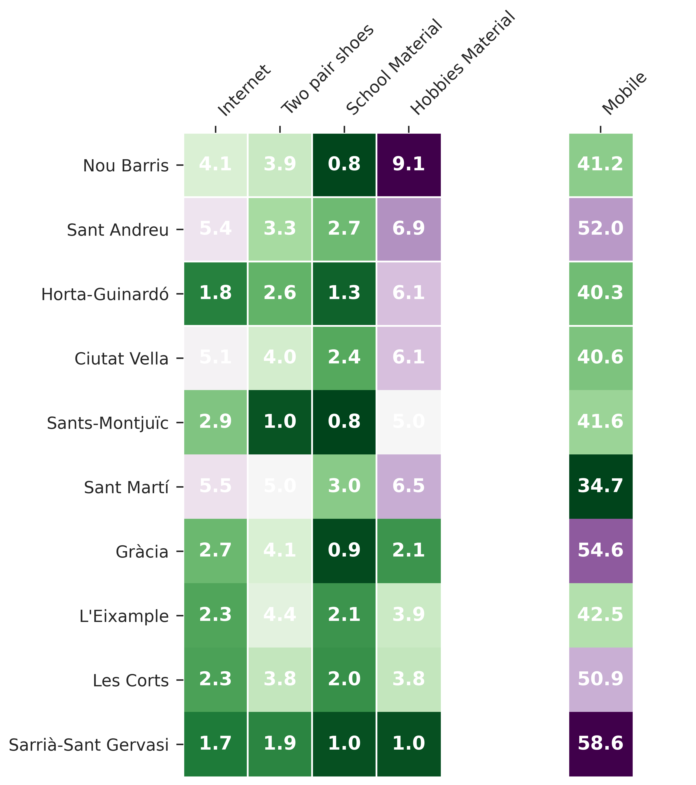
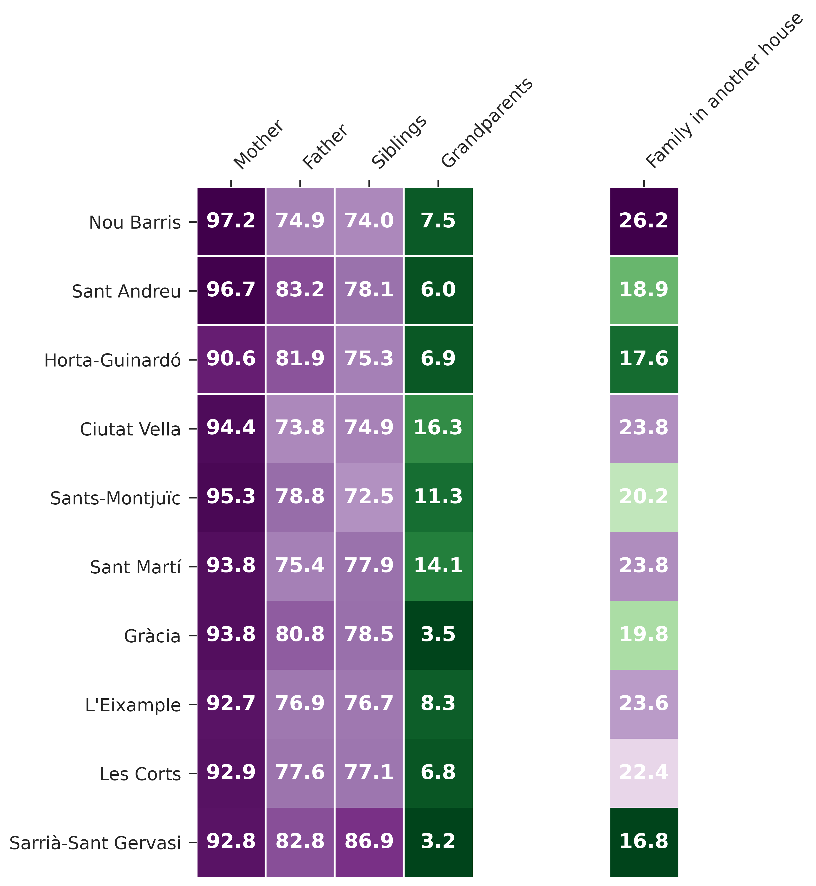

import Maps from "../components/maps";

# About the Districts 

Before going through the kids' perception of welfare it is interesting to evaluate the characteristics of the districts they live in.

First, the kids' perception on two valuable elements of their district are evaluated: Its **security** and its **areas dedicated for children**. In the survey, kids were asked how much they agreed on sentences: "I feel secure when walking through my neighbourhood" and "In the neighbourhood I live, there are enough areas where I can play". Their agreement was classified in different levels, however, to understand the behaviour by district we will focus on the proportion of kids that agreed with the statements.

<Maps />

In the plot presented, a lower ratio will indicate that there is a lower number of kids feeling secure or feeling that they have enough areas to play. The two plots are displayed together to compare if there is a shared pattern between the two elements.

It is possible to observe that the distribution is more diverse when it comes to security, compared to the playgrounds.  _Sants-Montjuïc_, _Ciutat Vella_ and _Nou Barris_ are the districts with the lowest agreement on security. As previously commented, _Nou Barris_ is the district with the lowest RFD index, however the other two fall in the intermediate-low range. _Sants-Montjuïc_ and _Ciutat Vella_ appear as well as the districts where kids don't agree on having enough areas to play, together with _Horta-Guinardó_. This highlights a potential relationship between the two elements, however correlation doesn't imply causality, and there could be an unexplored confounder such as, for example, the monetary investments the district received.

Secondly, it is interesting to assess the **material scarcities** that the children might be experiencing. To evaluate them, a set of Yes-No questions were evaluated and the proportion of No's are displayed:

The districts are ordered by descending RFD index, from _Nou Barris_ to _Sarrià-Sant Gervasi_. This ordering allows seeing how the more light colours fall in the bottom left of the table, showing that the wealthier have indeed more access to basic materials. It is interesting to evaluate the differences between categories. The proportion of kids that don't have enough **school materials** is lower than in other categories, indicating that most kids have access to them. However, the disparity is stronger when it comes to the **materials to do their hobbies** and having a **study place** to study at home. With the most disadvantaged neighbourhoods having the highest ratio of deficiencies. It is interesting as well to see the heavy differences between having or not a mobile phone. The higher ratio of kids that don't have a mobile phone is in the wealthier districts. Inverting the pattern previously observed on the other materials. Therefore, the proportion of kids in wealthier districts that have mobile phone is lower.

Another important aspect is to evaluate if there are differences in the family structure. To analyse it, the results of the question "Who lives with you in the house where you live all the time or the majority of the time?" 

The results show that in all districts there is a higher proportion of kids living with their **mothers** than with their **fathers**, the range is surprisingly different. Furthermore, it is possible to see that the proportion of kids living with their mothers is higher for the most disadvantaged districts. Looking at the ratios of **Family on another house**, it is possible to observe that the ratio doesn't strictly follow the wealthiness order, but still, the highest proportion is identified on _Nou Barris_ while the lowest in _Sarrià-Sant Gervasi_. 

