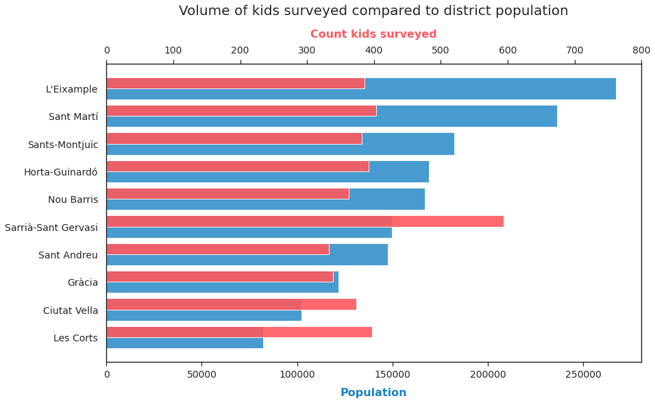
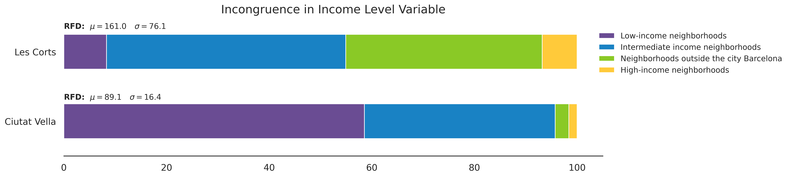
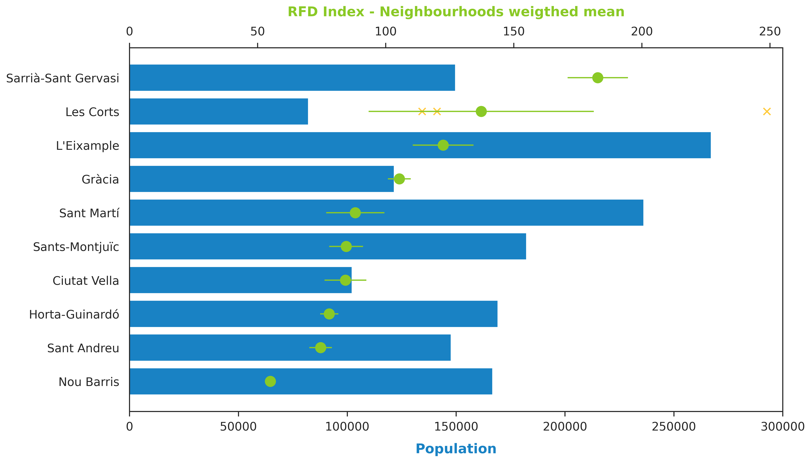

<!-- 
TODO:  
Talk about data sets in the beginning
Change the RFD - remove all things regarding the table
-->
# About the Data-set

As previously stated, the data stems from a [survey](https://w10.bcn.es/APPS/riswestudis/documentacio.do?reqCode=mostrarImatge&idDoc=10447)
from 2017, which looked at the subjective child welfare for kids in Barcelona. 
Furthermore, a data-set with detailed information on 2017 demographics of Barcelona neighbourhoods ([Income Territorial DataSet](https://opendata-ajuntament.barcelona.cat/data/en/dataset/est-renda-familiar))
was incorporated into the questionnaire, to get a deeper look into the characteristics for each district. 

The first step is to assess the available descriptive elements of the children surveyed.
To get a better overview of who the participants are, their gender and age distribution is evaluated, 
together with what grade they are in at school and their origin.
The different distributions are visualized using stacked bar plots, where the different answers are used as the categories. 

** PLOT **

When it comes to Gender and Grade, the survey is evenly distributed. 
Most of the kids are 10 - 11 years old, but almost 10% of them are already 12.
Furthermore, up to 85% of kids surveyed are from Catalonia, while around 10% are from another country.  

Now let's look at the districts of the kids surveyed and let's evaluate its distribution against the actual population from Barcelona:

Here, it's seen that the proportions of kids surveyed do not follow Barcelona's Population distribution. 
Rather, the most and least populated neighbourhoods have the same amount of answers 
and means that the survey results will not precisely represent Barcelona distribution. 
However, the amount of data points by district allows us to make conclusions about the districts separately.

Nevertheless, _Sarrà-Sant Gervasi_ has a representation of 600 kids while the rest of the neighbourhoods range between 350-400 kids. 
This is an important difference since _Sarrà-Sant Gervasi_ is a known expensive neighbourhood, which will be overrepresented on the aggregated results.  

When evaluating the different levels of income of the districts an incongruence was detected in the survey on variable `'ERFDbllp'`, 
which represents the different income levels (Low, Intermediate and High). 
It was possible to see that different income levels were associated with the same district, thus it was not possible to identify a unique income level by district.  

To analyse this situation, it was necessary to include the information from the actual RFD index of the district in the same year. 
This information was gathered from the beforementioned Territorial dataset from 
[BCN OpenData](https://upload.wikimedia.org/wikipedia/commons/a/ab/Barcelona_Barris_map.svg).

Two examples are used to display the incongruences:

The stacked bars highlights how different income levels are appointed to each district. 
At an early stage, the expectation was that each district would have one defined income level. 
However, it was possible to observe that the differences came from the aggregation of neighbourhoods to districts. 
In the Survey data, we don't have the _neighbourhoods_ where the kids are from, only their _district_. 
But in variable `'ERFDbllp'` the information is provided at neighbourhood level.

Observing the two examples provided, it is possible to see the diversity within districts 
and recognize that there is not always a predominant level above the others. 

In _Ciutat Vella_  60% of the kids surveyed are from a low-income neighbourhood and up to 35% from an intermediate-income level.  
A different situation is encountered in _Les Corts_, where almost 40% of the kids are from a neighbourhood marked outside of Barcelona. 
This highlights a potential error in the data set: That neighbourhoods are stated as being outside of Barcelona. 
_Les Corts_ falls on the border of Barcelona municipality, limiting at its west, north-west and south with three different municipalities. 
Therefore, it could be that one neighbourhood was incorrectly labelled as outside of Barcelona or 
that one neighbourhood from another municipality was included in the study. 
Regardless of the situation, the data from _Les Corts_ will still be used since the objective is not to accurately represent the children
only from the Barcelona municipality, but to get an overview of the children's welfare in the area.

Using the economical data from the districts, it is possible to find the RFD index("Renta Familiar Disponible", translated to "Available Family Income") for each 
district, to get an overview of which districts are more wealthy than others. A plot has been created, where the bottom axis shows the population count,
while the top axis shows the RFD index weighted mean, together with its standard error.

It is possible to observe that there are some districts wealthier than others. 
With _Sarrià-Sant Gervasi_, _Les Corts_ and _L'Eixample_ being the wealthiest and _Nou Barris_, _Sant Andreu_ and _Horta-Guinardó_ the least wealthy. 

However, it is important to discuss on the high standard error of _Les Corts_. 
The district only includes 3 neighbourhoods (a low number compared to the other districts, as dispalyed in section: _Territorial Distribution_ ), 
and the neighbourhoods are very diverse. In fact, the RFD index of each neighbourhood was included in the plot (with yellow crosses) to highlight their differences. 
The neighbourhood with the highest index corresponds to _Pedralbes_, which is the known most expensive area in Barcelona city, 
being the dwelling of the Consulate of the United States of America and residence of billionaires. 
This neighbourhood is far from any other, including _La Maternitat and Les Corts (barri)_ the two other neighbourhood from the district.
